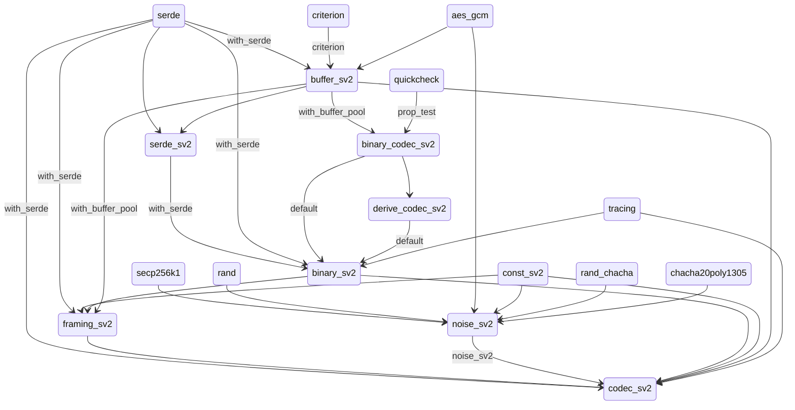

```mermaid
stateDiagram-v2
    secp256k1 --> noise_sv2
    rand --> noise_sv2
    aes_gcm --> noise_sv2
    const_sv2 --> noise_sv2
    rand_chacha --> noise_sv2
    chacha20poly1305 --> noise_sv2

    serde --> buffer_sv2: with_serde
    criterion --> buffer_sv2: criterion
    aes_gcm --> buffer_sv2

    buffer_sv2 --> binary_codec_sv2: with_buffer_pool
    quickcheck --> binary_codec_sv2: prop_test

    binary_codec_sv2 --> derive_codec_sv2

    serde --> serde_sv2
    buffer_sv2 --> serde_sv2

    serde_sv2 --> binary_sv2: with_serde
    serde --> binary_sv2: with_serde
    binary_codec_sv2 --> binary_sv2: default
    derive_codec_sv2 --> binary_sv2: default
    tracing --> binary_sv2

    serde --> framing_sv2: with_serde
    const_sv2 --> framing_sv2
    binary_sv2 --> framing_sv2
    buffer_sv2 --> framing_sv2: with_buffer_pool

    serde --> codec_sv2: with_serde
    framing_sv2 --> codec_sv2
    noise_sv2 --> codec_sv2: noise_sv2
    binary_sv2 --> codec_sv2
    const_sv2 --> codec_sv2
    buffer_sv2 --> codec_sv2
    tracing --> codec_sv2
```